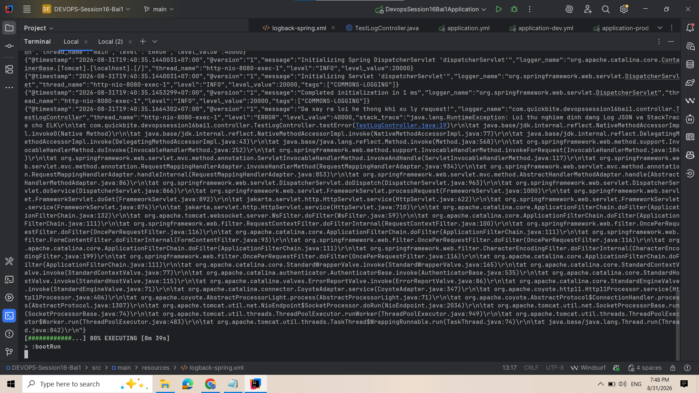

1. Khắc Phục Lỗi Dính Chùm Log Exception Trên Kibana / ELK Stack

Bước 1: Tích hợp thư viện Logstash Logback Encoder vào build.gradle

dependencies {
    implementation 'org.springframework.boot:spring-boot-starter-webmvc'
    testImplementation 'org.springframework.boot:spring-boot-starter-webmvc-test'
    testRuntimeOnly 'org.junit.platform:junit-platform-launcher'
    implementation 'net.logstash.logback:logstash-logback-encoder:7.4'
}

Bước 2: Cấu hình src/main/resources/logback-spring.xml sử dụng LogstashEncoder

<configuration>
    <appender name="CONSOLE_JSON" class="ch.qos.logback.core.ConsoleAppender">
        <encoder class="net.logstash.logback.encoder.LogstashEncoder" />
    </appender>

    <root level="INFO">
        <appender-ref ref="CONSOLE_JSON" />
    </root>
</configuration>

Bước 3: Khởi chạy và kiểm thử qua API Test Exception

Lệnh khởi chạy:
./gradlew bootRun

Lệnh gọi API kích hoạt Exception:
curl http://localhost:8080/api/test-error

### 🖼️ Ảnh 1: Console in Log ở định dạng JSON hoàn chỉnh, thông tin Exception được gom gọn vào field stack_trace

2. Giải Thích Lý Thuyết & Đáp Án

Lý do log plaintext bị dính chùm khi đẩy qua Filebeat/Logstash lên Elasticsearch:
- Khi xảy ra lỗi Exception, Java mặc định in ra vết lỗi (stack trace) gồm hàng chục dòng text riêng biệt. Công cụ thu thập log như Filebeat đọc theo cơ chế từng dòng (line-by-line). Nếu không có cấu hình đặc biệt, Filebeat sẽ hiểu mỗi dòng stack trace là một log record độc lập, gây vỡ cấu trúc log và khiến Kibana không thể phân tích hay lọc dữ liệu chính xác.

Ưu điểm vượt trội của việc ghi log dạng JSON chuẩn LogstashEncoder:
- Mỗi sự kiện log (kể cả Exception hàng chục dòng) được gói gọn hoàn toàn trong một JSON Object duy nhất trên một dòng.
- Vết lỗi Exception được tự động đưa vào field `stack_trace`, giúp Filebeat và Elasticsearch bóc tách dữ liệu (parsing) cực kỳ dễ dàng mà không cần dùng regex phức tạp.
- Cung cấp sẵn các trường metadata quan trọng (`@timestamp`, `level`, `logger_name`, `thread_name`), chuẩn hóa dữ liệu đầu vào cho hệ thống quản lý log tập trung ELK Stack.
